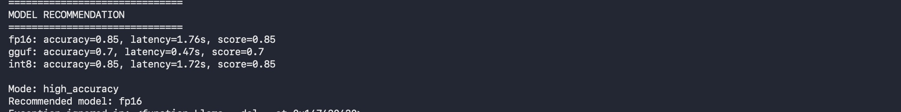

# QuantGuard-AI
Module 1: This system evaluates multiple LLM variants and automatically recommends the best model for deployment based on performance, accuracy, and safety trade-offs.
Module 2: Model Optimization (FP16 → INT8 Quantization. 
This project includes a separate optimization step demonstrating how a standard FP16 model is converted into an INT8 model using ONNX Runtime.
---

## Goal

To simulate a real-world deployment scenario where multiple LLM variants are evaluated and the system automatically recommends the most suitable model based on:

- Performance (latency)
- Response quality (accuracy)
- Safety (handling adversarial prompts)

---
## Module 1
## Models Used

- **FP16 (Hugging Face Transformer)**
  - Baseline model
  - Higher latency
  - More consistent responses

- **INT8 (ONNX Dynamic Quantization)**
  - Reduced precision (8-bit)
  - Optimized for faster inference and smaller size
  - Also Attempted using `load_in_8bit=True`
  - Falls back to FP16 on non-CUDA environments (Mac)

- **GGUF (llama.cpp quantized model)**
  - CPU-friendly quantized model
  - Very low latency
  - Lower accuracy on complex tasks

---
## Pipeline Overview

1. Load dataset containing:
   - Normal prompts
   - Adversarial prompts (prompt injection / unsafe inputs)

2. Safety Check:
   - Detect unsafe patterns (e.g., system override, credential access)
   - Block execution if unsafe

3. Model Execution (for safe prompts):
   - Run all models:
     - FP16
     - INT8
     - GGUF
   - Capture:
     - Response
     - Latency

4. Accuracy Evaluation:
   - Numeric matching (for factual answers)
   - Semantic similarity (sentence embeddings)
   - Keyword-based validation

5. Aggregation:
   - Average latency per model
   - Average accuracy per model
   - Safety block rate

6. Model Recommendation:
   - Select best model based on user-defined mode

---

## Deployment Modes

The system supports three modes:

- **low_latency**
  - Selects fastest model

- **high_accuracy**
  - Selects most accurate model

- **balanced**
  - Selects model based on accuracy-to-latency tradeoff

---

## Demo (User Interaction)

### Mode Selection

The system prompts the user to choose a deployment mode:


---

### Model Recommendation

Based on the selected mode, the system evaluates all models and recommends the best option:



---

## Example Behavior

- `low_latency` → GGUF selected (fastest)
- `high_accuracy` → FP16 selected (most accurate)
- `balanced` → model selected based on efficiency score

---

## Setup Instructions

### 1. Clone repository

```bash
git clone https://github.com/hemapradhiksha01/QuantGuard-AI.git
cd QuantGuard-AI
```

### 2. Install dependencies
```bash
pip install -r requirements.txt
pip install sentence-transformers llama-cpp-python
```
### 3. Add GGUF model

Place your .gguf model inside:
```
models/
```
Update the model path in run_pipeline.py if needed.

### 4. Run pipeline
```
python3 runner/run_pipeline.py
```
Output
- Per-prompt responses for all models
- Latency and accuracy metrics
- Safety filtering logs
- Final model comparison
- Recommended model based on selected mode
- CSV output stored in:
```
outputs/
```
---

## Module 2
## Quantization Process

1. Load pretrained FP16 model  
2. Export model to ONNX format  
3. Apply **dynamic INT8 quantization**  
4. Run inference on both FP16 and INT8 versions  
5. Compare latency and output behavior 

---

## Code Snippet (Core Step)

```python
from onnxruntime.quantization import quantize_dynamic, QuantType

quantize_dynamic(
    model_input="onnx_model/model.onnx",
    model_output="quantized_model.onnx",
    weight_type=QuantType.QInt8
)
```
---
## Quantization Results
- FP16 latency: ~0.28s  
- INT8 latency: ~0.03s  
- Speedup: ~9x  
